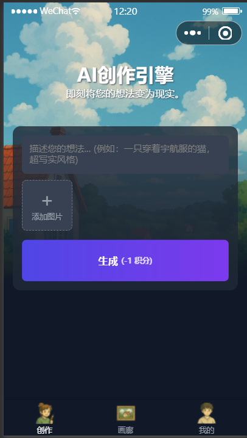
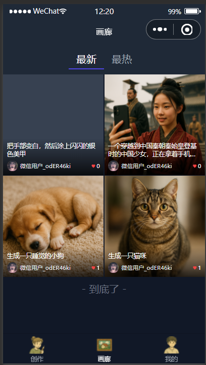
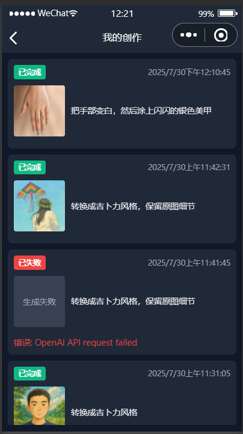

# OpenAi 项目

## 项目概述
本项目是一个基于 Node.js Express 后端和 Vue 前端构建的 AI 聊天与创作平台。后端支持 GPT-4o 文本聊天、AI 生图、历史对话管理、用户认证与信息管理、以及 Token 接口。前端提供直观的用户界面，实现聊天、生图、画廊展示、个人中心等功能。

## 技术栈
### 后端 (nodeJs/)
- **框架**: Express.js
- **数据库**: MongoDB (通过 Mongoose ODM)
- **AI 服务**: OpenAI API (GPT-4o)
- **其他**: Axios (HTTP 客户端), CORS (跨域), Dotenv (环境变量), jsonwebtoken (JWT 认证), express-fileupload (文件上传)

### 前端 (openai-chat/)
- **框架**: Vue.js (可能结合 Uni-app 用于多端开发)
- **UI**: 自定义组件和样式
- **网络请求**: uni.request (Uni-app 封装的请求)

## 目录结构

- `nodeJs/`：后端服务相关代码
    - `config/`：数据库配置
    - `models/`：Mongoose 数据模型 (User, Creation, CreditRecord)
    - `routes/`：API 路由 (balance, chat, common, gallery, history, image, token, user, wxLogin)
    - `utils/`：工具函数 (historyStore, image2Base64)
- `openai-chat/`：前端页面和组件
    - `components/`：Vue 组件 (ChatView, HistoryDialog, ImageGenView)
    - `pages/`：主要页面 (gallery, index, profile)
    - `pkg_history/`：历史记录相关页面
    - `pkg_user/`：用户相关页面 (agreement, credits, feedback, privacy, settings, tasks)
    - `static/`：静态资源 (图片)
    - `utils/`：前端工具函数 (api, global)

## 核心功能

-   **聊天交互**: 提供用户与 AI 进行文本对话的功能。前端通过 `ChatView.vue` 组件展示对话界面，后端通过 `/api/chat` 接口处理消息并调用 OpenAI GPT-4o 服务。
-   **图像生成**: 支持用户输入描述生成图像。前端通过 `ImageGenView.vue` 提供操作界面，后端通过 `/api/image` 接口处理生成请求。
-   **历史记录管理**: 记录并展示用户的聊天和图像生成历史。后端通过 `/api/history` 接口提供历史数据，前端在 `pkg_history/pages/list.vue` 等页面进行展示。
-   **用户账户**: 包含用户注册、登录、个人信息管理及积分查询。后端通过 `/api/user` 和 `/api/token` 等接口提供服务，前端在 `pkg_user/` 目录下的相关页面实现。
-   **作品画廊**: 展示用户生成的图像作品。前端通过 `pages/gallery/index.vue` 页面呈现，作品数据可能来源于后端相关接口或用户创作记录。
-   **微信集成**: 支持通过微信进行用户登录和身份验证。后端通过 `/api/wxLogin` 接口处理微信登录逻辑。

## 快速开始

1.  **克隆项目**:
    ```bash
    git clone [你的项目仓库地址]
    cd OpenAi
    ```

2.  **后端服务设置 (nodeJs/)**:
    ```bash
    cd nodeJs
    npm install
    # 配置环境变量 (例如，在 .env 文件中设置 OpenAI API Key, MongoDB 连接字符串等)
    npm start
    ```
    后端服务通常会在 `http://localhost:3000` 启动。

3.  **前端应用设置 (openai-chat/)**:
    ```bash
    cd ../openai-chat
    npm install
    # 根据需要配置 API 请求地址 (通常在 utils/api.js 或类似文件中)
    npm run dev # 或其他启动命令，具体取决于你的前端框架/构建工具
    ```
    前端应用通常会在 `http://localhost:8080` 或其他端口启动。

## 截图展示

### 首页


### 我的


### 画廊


### 积分记录


### 我的创作


### 设置


### 意见反馈
